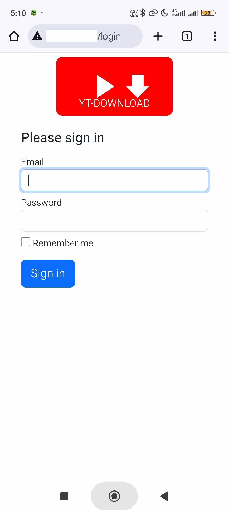
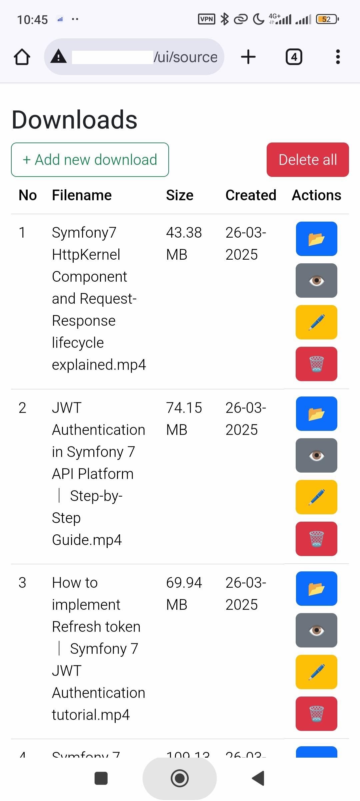

# Небольшой сервис для скачивания видео с youtube, rutube, vkontakte.

PHP 8, Symfony 7, docker, pgsql, yt-dlp, norkunas/youtube-dl-php.

## Preview  
    

## Запуск проекта:  
1. Поднять контейнер с приложением:
```bash
cd docker/
docker-compose up -d
```
2. Подтянуть зависимости composer
```bash
docker exec ytdownloader-php-fpm composer install
docker exec ytdownloader-php-fpm composer update
```
3. Создать базу данных и накатить миграции
```bash
docker exec ytdownloader-php-fpm php bin/console doctrine:database:create --if-not-exists
docker exec ytdownloader-php-fpm php bin/console doctrine:migrations:migrate
```
Примечание: необходимо добавить файл .env.local с настройками базы данных, при этом hostname должен быть по названию контейнера с базой - 'ytdownloader-pgsql').
4. Запустить воркер для обработки очередей
```bash
docker exec ytdownloader-php-fpm /etc/init.d/supervisor start
```
5. Создать нового юзера:
```php
docker exec ytdownloader-php-fpm php bin/console user:add <username>
``` 
6. Запустить тесты:
```bash
docker exec ytdownloader-php-fpm sh bin/test.sh
```
7. Health check
```
GET http://host.tld/health
```

## Todo:
1. ~Сделать скачивание видео с ютуба в фоновом режиме (с помощью очередей).~
2. ~Добавить инфу о скачивании видео в фоне.~
3. Использование кеша ютуба из браузера для избежания блокировки (ютуб может думать что сервис является ботом).
4. ~Пофиксить баг с плейлистами - если в имени плейлиста есть спец. символы, то может возникнуть проблема со скачиванием этого плейлиста.~
5. Добавить счетчик скачанных видео, статистику.
6. ~Написать тесты.~
7. ~Вынести логику из контроллеров в сервисы.~
8. ~Добавить health check~
9. Добавить Api
10. Добавить телеграм бота
11. Добавить bash скрипт для автоматизации первоначальных настроек, создания базы, запуска мираций, запуска очередей.
