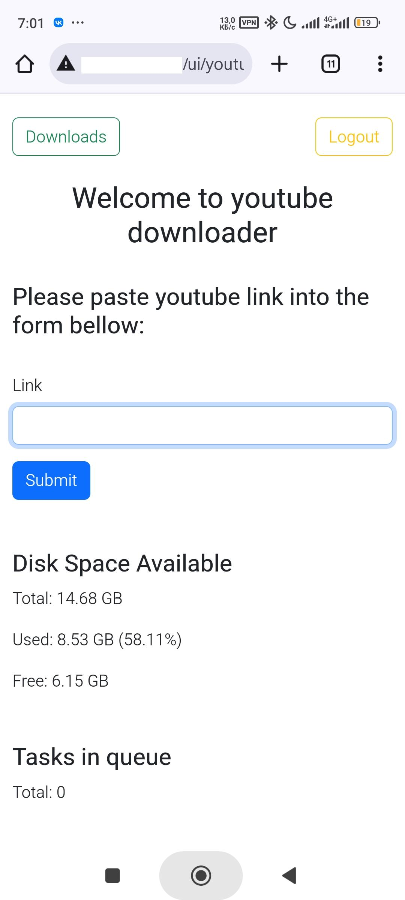
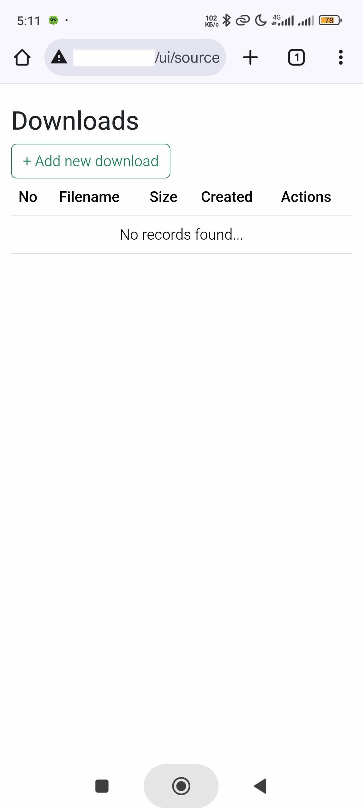
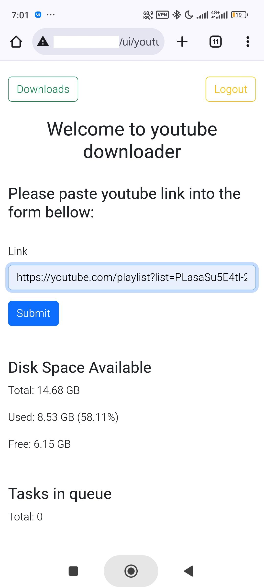

# Небольшой сервис для скачивания видео с youtube

PHP 8, Symfony 7, docker, yt-dlp, norkunas/youtube-dl-php.







## Полезное  
1. Запуск проекта:
``` bash
docker-compose -f docker/docker-compose.yaml up -d
```
2. Создать нового юзера:
```php
php bin/console user:add <username>
``` 
